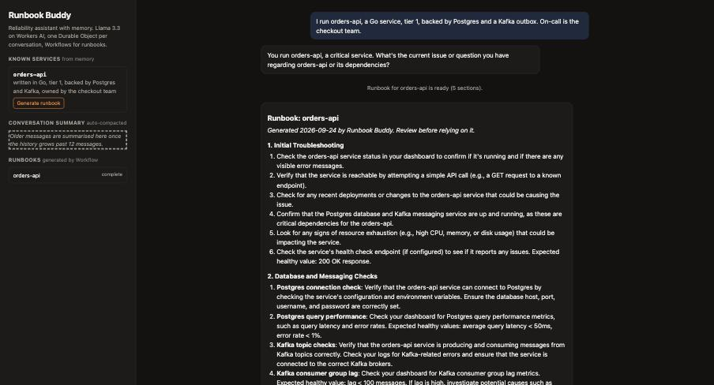
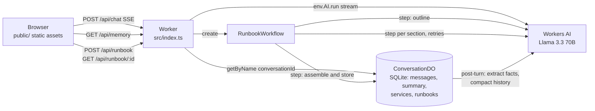

# Runbook Buddy

A small reliability assistant for on-call engineers, built on Cloudflare. It chats
with you about the services you run, remembers them across sessions, walks through
incident checks one step at a time, and can generate a full incident runbook for any
service it knows about as a durable multi-step Workflow.

**Live demo:** https://runbook-buddy.krishnanbhupathi.workers.dev



Built for Cloudflare's optional AI-application assignment. AI-assisted coding was used;
the complete prompt history is in [PROMPTS.md](PROMPTS.md).

## What it does

1. **Chat** with a reliability assistant backed by Llama 3.3 70B on Workers AI. Replies
   stream token by token.
2. **Memory**: each conversation is a Durable Object. It stores the message history,
   extracts durable facts about your services from what you say (name, language, tier,
   owner, dependencies), and once the history grows past 12 messages it summarises the
   older turns into a rolling summary so context stays bounded.
3. **Runbook generation**: click "Generate runbook" on a known service, or type
   `/runbook <service>`. A Cloudflare Workflow drafts an outline, then writes each
   section as its own retried, checkpointed step, and stores the assembled Markdown back
   into the conversation's memory.

## Architecture



Request flow for one chat turn:

1. Browser posts `{ conversationId, message }`. The ID lives in the browser's
   localStorage and is generated client-side.
2. The Worker gets the Durable Object stub for that ID, appends the user message, and asks
   the DO to build the model context: system prompt, known services, rolling summary, then
   the recent verbatim messages.
3. The Worker calls Workers AI with `stream: true` and tees the SSE stream: one branch goes
   straight to the browser, the other is parsed to recover the full reply text.
4. After the stream ends (`ctx.waitUntil`, off the response path) the reply is stored, then
   the DO runs maintenance: service-fact extraction from the user message, and summary
   compaction if the history is over the limit.

## How the four required components are met

| Requirement | Implementation | Where |
|---|---|---|
| **LLM** | Llama 3.3 70B (`@cf/meta/llama-3.3-70b-instruct-fp8-fast`) on Workers AI, via the `AI` binding. Streaming for chat, non-streaming for extraction, summarisation and runbook sections. | `src/llm.ts` |
| **Workflow / coordination** | `RunbookWorkflow` (Cloudflare Workflows): outline step, one `step.do` per section with `retries: { limit: 3, backoff: "exponential" }`, final assemble-and-store step. Failures after retries are recorded in memory. The Worker also coordinates chat turns across the DO and Workers AI. | `src/runbook-workflow.ts`, `src/runbook.ts` |
| **User input via chat** | Plain HTML/CSS/JS chat UI served as Workers static assets from `public/`. No framework, no build step. | `public/` |
| **Memory / state** | `ConversationDO`, one SQLite-backed Durable Object per conversation: message history, rolling LLM-written summary, extracted service facts, generated runbooks. | `src/conversation-do.ts`, `src/memory.ts` |

A note on "Pages": Cloudflare now recommends Workers static assets over Pages for new
projects, and it keeps this to a single deploy, so the UI is served by the same Worker
rather than a separate Pages project. Moving `public/` to Pages would be a config change,
not a code change.

## Repository layout

```
wrangler.jsonc            bindings: AI, Durable Object (SQLite), Workflow, static assets
src/index.ts              Worker: routing, chat streaming, runbook endpoints
src/conversation-do.ts    Durable Object: storage, context building, post-turn maintenance
src/memory.ts             pure memory logic (compaction, extraction parsing, upsert)
src/runbook-workflow.ts   the Workflow class
src/runbook.ts            pure runbook logic (prompts, outline parsing, assembly)
src/llm.ts                Workers AI wrapper, handles both response shapes
src/sse.ts                tee the SSE stream and recover the text
src/prompts.ts            system prompt
public/                   chat UI
test/                     vitest suites; test/stubs aliases cloudflare:workers
PROMPTS.md                full prompt history
```

## Run locally

Requires Node 18+ and a Cloudflare account (free plan is enough).

```bash
npm install
npx wrangler login        # one-time browser OAuth
npm run dev               # http://localhost:8787
```

Durable Objects and Workflows run in the local simulator. **Workers AI always calls
Cloudflare's hosted inference, even in local dev**, so requests count against your daily
free-tier neuron quota (about 10 to 15 neurons per chat turn; a runbook is about 6 model
calls). No API keys or secrets are needed; `.dev.vars.example` exists only as a
placeholder for the day one is added.

Quick API check without the UI:

```bash
curl -N localhost:8787/api/chat -H 'content-type: application/json' \
  -d '{"conversationId":"demo-0001","message":"I run checkout-api, tier 1, Go, on Postgres."}'
curl "localhost:8787/api/memory?conversationId=demo-0001"
curl localhost:8787/api/runbook -H 'content-type: application/json' \
  -d '{"conversationId":"demo-0001","service":"checkout-api"}'
```

## Test

```bash
npm test          # vitest, 33 tests, well under a second
npm run typecheck
```

Tests cover the non-trivial logic without a Workers runtime: memory compaction and
splitting, defensive parsing of model JSON, service upsert/merge, SSE parsing across chunk
boundaries, and the Workflow's `run()` driven with a fake `step` (step ordering, outline
fallback, failure recording, retry triggers).

## Deploy

```bash
npm run deploy
```

`wrangler deploy` uploads the Worker, the static assets, the Durable Object migration and
the Workflow in one step, and prints the `*.workers.dev` URL.

## API

| Method | Path | Body / query | Response |
|---|---|---|---|
| POST | `/api/chat` | `{ conversationId, message }` | `text/event-stream`; or `202 { workflowId }` if the message is `/runbook <service>` |
| GET | `/api/memory` | `?conversationId=` | `{ summary, messages, services, runbooks }` |
| DELETE | `/api/memory` | `?conversationId=` | wipes the conversation |
| POST | `/api/runbook` | `{ conversationId, service }` | `202 { workflowId, service }` |
| GET | `/api/runbook/:id` | | `{ status, error, output }` from the Workflow instance |

`conversationId` must match `[a-zA-Z0-9_-]{8,64}`.

## Honest limitations

- **No authentication.** Anyone who knows or guesses a conversation ID can read it. The
  ID is a random 96-bit value generated in the browser, which is fine for a demo and not
  for real incident data.
- **Service extraction is best-effort.** It is an LLM call with a JSON prompt and a
  tolerant parser; it can miss facts or occasionally record something odd. The prompt was
  tightened after it recorded "Postgres" as a service during testing.
- **Runbooks are generic.** The model only knows what you have told it, and is instructed
  not to invent tool names or URLs. Treat output as a draft.
- **The UI polls** the Workflow status every 3 seconds rather than using WebSockets or
  Realtime.
- **Free-tier quotas.** The live demo runs on the Workers Free plan. Heavy use will hit
  the daily Workers AI limit and requests will fail until it resets.
- Chat history for one conversation is kept in a single Durable Object, which is the
  right unit here but means a very long-lived conversation cannot be sharded.

## License

MIT, see [LICENSE](LICENSE).
